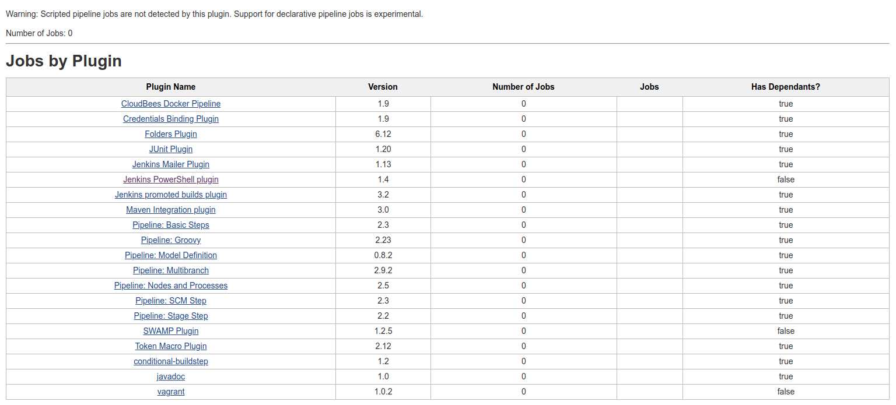

# Jenkins plugin-usage-plugin

This plugin gives you the possibility to analyze the usage of your
installed plugins.

## Usage

You can find the plugin on sidepanel of Jenkins. Every user is able to
use this plugin.

The plugin will give you a report on how much every plugin will be used
in all of your jobs (see the screenshot below). Therefore it will
analyze the used extension points of each job.  
**Plugins used in pipeline scripts would not be listed normally as used
by jobs, because they are used dynamically in Jenkinsfiles.**

## Supported Extension points

This plugins will first iterate through jobs to gather those types of
extension points:

-   Builder
-   BuildWrapper
-   JobProperty
-   Publisher
-   SCM
-   Trigger

and will add other plugins at the end. 
